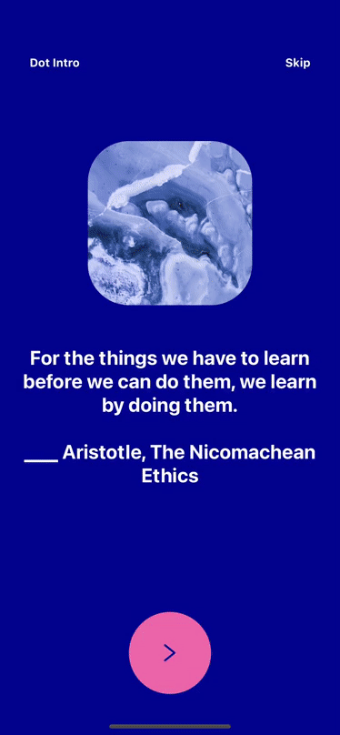

# React Native Dot Intro

This react native module is intended to provide a beautifully animated onboarding screen that you can customise and use in your own projects.



## Usage

```
yarn add @toggled-apps/react-native-dot-intro

or 

npm install @toggled-apps/react-native-dot-intro
```

### Example Usage
```javascript
import * as React from "react";
import { View } from "react-native";
import RNDotIntro from "@toggled-apps/react-native-dot-intro";

const colors = [{
    arrowColor: "#000B92",
    textColor: "white",
    initialBgColor: "#000B92",
    bgColor: "#F576AA",
    nextBgColor: "#F576AA",
  },];

const contents = [{
    image: { uri: "https://reactnative.dev/img/tiny_logo.png" },
    text: "Welcome to my app",
  },];

export default function App() {
  return (
    <View
      style={{
        flex: 1,
      }}
    >
      <RNDotIntro
        colors={colors}
        contents={contents}
        imageWidth={200}
        imageHeight={200}
        onEnd={() => {console.log("Handle onEnd e.g. navigate to app")}}
        title="Dot Intro"
      />
    </View>
  );
}

```

## Props

|Name|Type|Required|Default|Description|
|---|---|---|---|---|
|colors|object|Required|None|An array of objects `{ arrowColor: "#000B92", textColor: "white", initialBgColor: "#000B92", bgColor: "#F576AA", nextBgColor: "#F576AA"}` a mixture of hexcodes and color names may be used see [React Native Default Colors](https://reactnative.dev/docs/colors).<br/><br/>initialBgColor -> Big background of the element<br/>bgColor -> initial circle bg color that will be the next slide initial BG Color<br/>nextBgColor -> next circle bg color after we fully transition the circle and this will be small again</br>prev bgColor === next initialBgColor<br/>prev nextBgColor === next bgColor`.<br/><br/>Note: the length of the colors array must match the length of the contents array.|
|contents|object|Required|None|An array of objects<br/>`{image: { uri: "https://reactnative.dev/img/tiny_logo.png" }, text: "Welcome to my app"}`.<br/>Image object may contain a uri or you may pass a local image using<br/>`{image: require('../path/to/image'), text: "Welcome to my app"}`.<br/><br/>The `image` object is optional and `text` can be ""<br/><br/>Note: the length of the colors array must match the length of the contents array.|
|duration|number|Optional|1000|Duration of the transition animation.|
|imageBorderRadius|number|Optional|50|Border radius of image.|
|imageWidth|number|Optional|125|Width of the image.|
|imageHeight|number|Optional|125|Height of image.|
|onEnd|Function|Required|None|A function that is called when the app intro component is finished or you the user has opted to skip (if enabled).|
|textDuration|number|Optional|800|Duration of the text transition animation.|
|titles|array|Optional|""|Name of your App or alternatively the title of this section of your app.|
|skip|boolean|Optional|true|Boolean to enable or disable the skip button. If enabled and pressed onEnd function will be called.|

## 🚀 Run the example
The provided example uses [expo](https://expo.io/). Navigate to the "example" directory and run:

- Install packages with `yarn` or `npm install`.
- Run `yarn ios` or `yarn android` or `npm run ios` or `npm run android`.

## 💸 Credit

Credit goes to Catalin Miron for providing both an insightful [tutorial](https://youtu.be/vQNg06Hf0MQ) and also the [source code](https://github.com/catalinmiron/react-native-dot-inversion) on which this module is based off of.

Credit also goes to Cuberto for making this concept avaliable. The dribble can be found [here](https://dribbble.com/shots/6654320-Animated-Onboarding-Screens)

## 🤟 Contributions
This project is mantained by Toggled LTD (@toggled-apps).

We welcome all contributions to the upkeep and further development of this module! Feel free to raise PRs and Issues 😇

## MIT License
Copyright 2020 Toggled LTD

Permission is hereby granted, free of charge, to any person obtaining a copy of this software and associated documentation files (the "Software"), to deal in the Software without restriction, including without limitation the rights to use, copy, modify, merge, publish, distribute, sublicense, and/or sell copies of the Software, and to permit persons to whom the Software is furnished to do so, subject to the following conditions:

The above copyright notice and this permission notice shall be included in all copies or substantial portions of the Software.

THE SOFTWARE IS PROVIDED "AS IS", WITHOUT WARRANTY OF ANY KIND, EXPRESS OR IMPLIED, INCLUDING BUT NOT LIMITED TO THE WARRANTIES OF MERCHANTABILITY, FITNESS FOR A PARTICULAR PURPOSE AND NONINFRINGEMENT. IN NO EVENT SHALL THE AUTHORS OR COPYRIGHT HOLDERS BE LIABLE FOR ANY CLAIM, DAMAGES OR OTHER LIABILITY, WHETHER IN AN ACTION OF CONTRACT, TORT OR OTHERWISE, ARISING FROM, OUT OF OR IN CONNECTION WITH THE SOFTWARE OR THE USE OR OTHER DEALINGS IN THE SOFTWARE.

